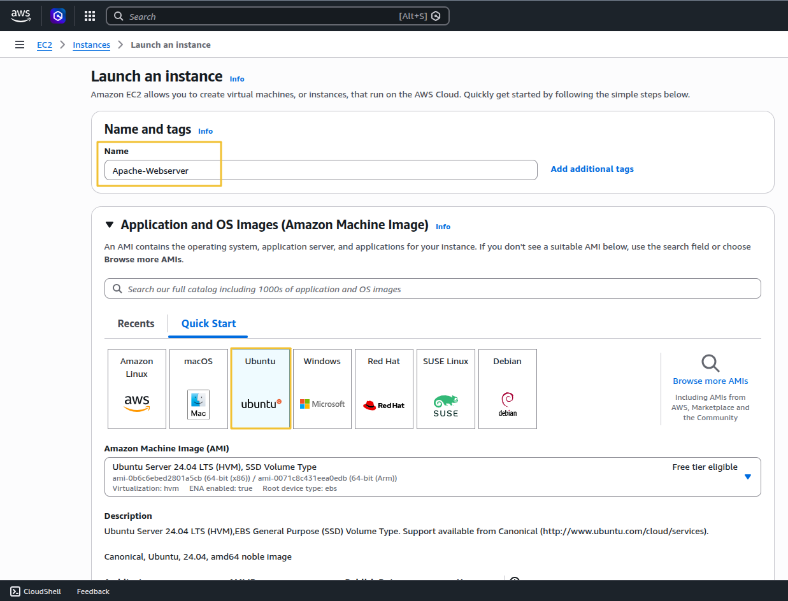
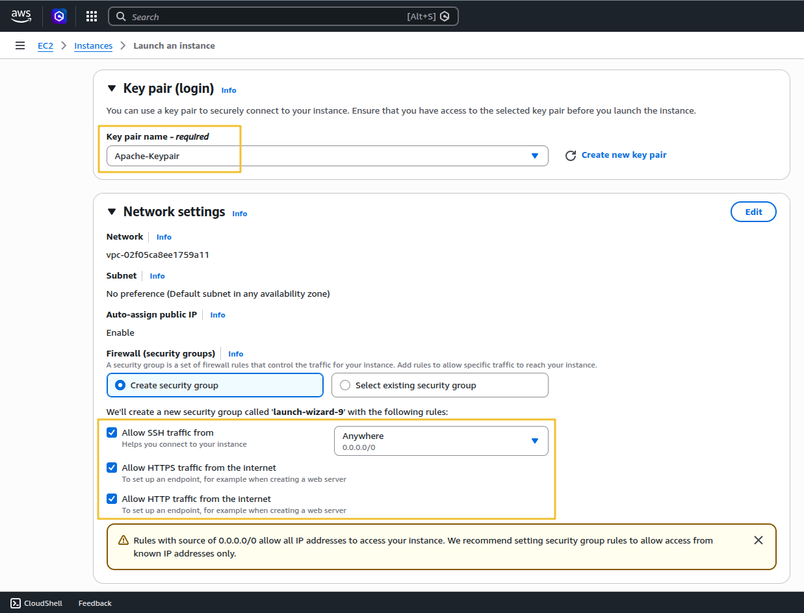
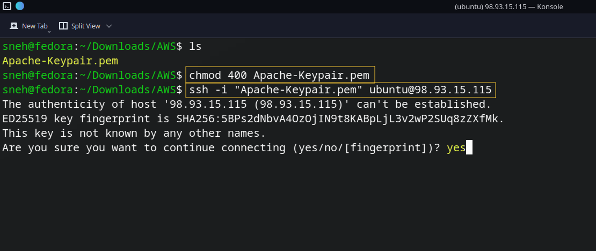
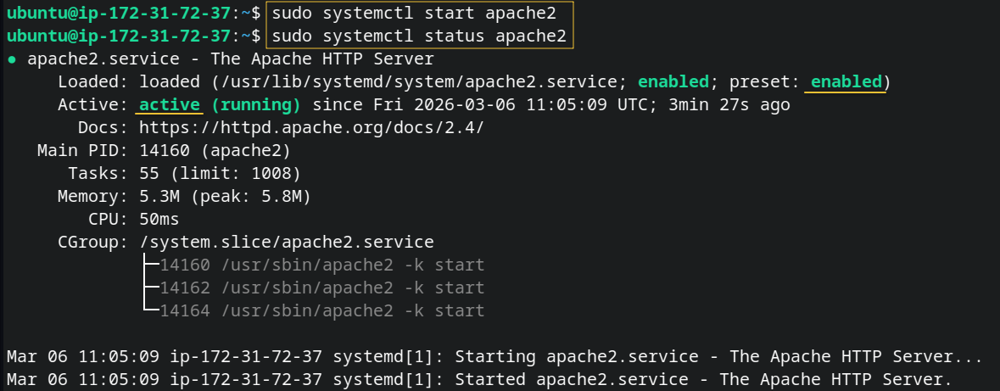
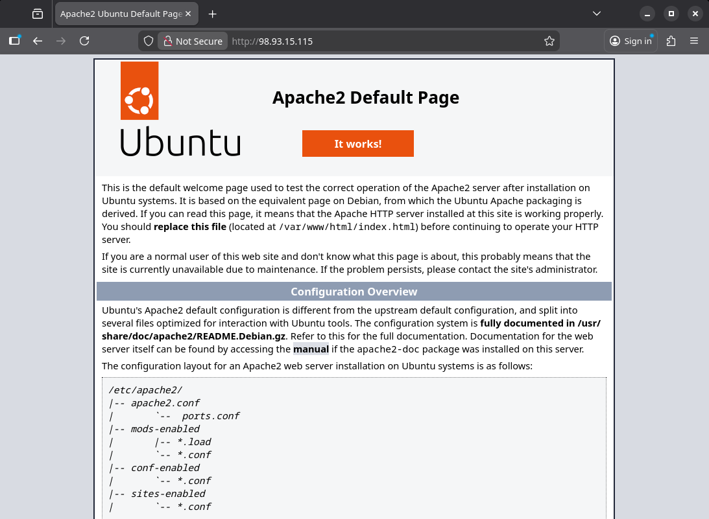
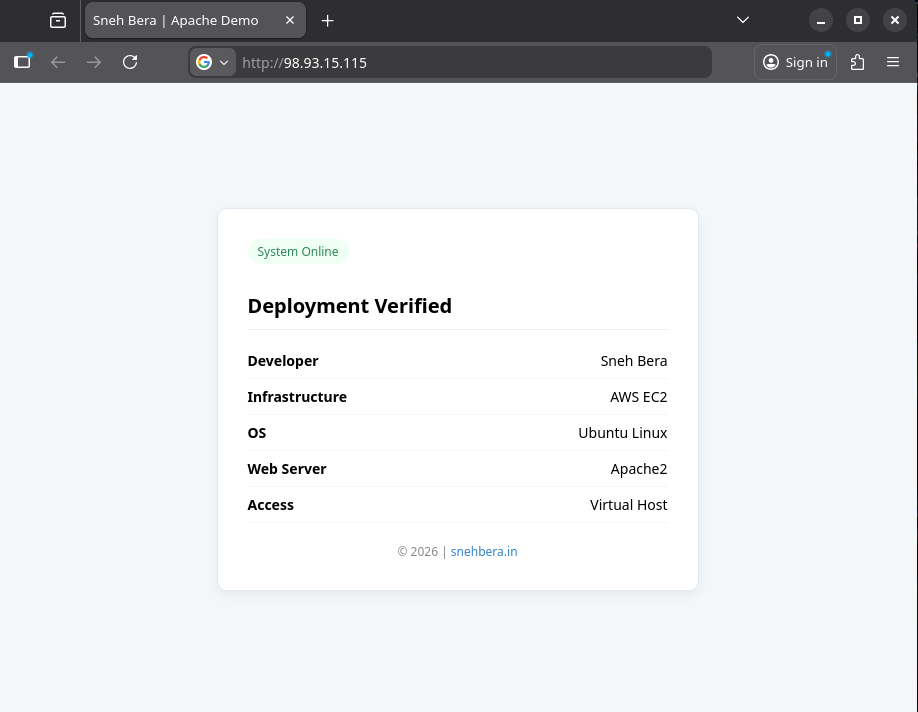

## Prerequisites

Before starting this tutorial, make sure you have the following:

- **AWS Account**  
  You will need an active AWS account to create and manage an EC2 instance.

- **Basic Linux Command Knowledge**  
  Familiarity with simple Linux commands such as `cd`, `ls`, and `sudo` will help you navigate and manage the server environment.

- **SSH Client Installed**  
  You will connect to the EC2 instance using SSH. Tools like **OpenSSH** (Linux/macOS) or **PuTTY** (Windows) can be used.

## Introduction

Have you ever wondered how your favorite websites actually appear on the internet? Behind almost every website is a web server that delivers pages to browsers around the world.

In this guide, we will deploy one of the most popular open-source web servers in the world: **Apache**, running on an **Ubuntu Server** hosted on **AWS EC2**.

Don’t worry if you have never worked with a server before. This tutorial walks through the entire process step-by-step, explaining not only what commands to run, but also why they are necessary. By the end of this guide, you will understand how to launch a cloud server, install Apache, and host a basic website on AWS.

## Why Use Ubuntu for the Server?

Ubuntu is one of the most popular Linux distributions used in cloud environments. When setting up a web server, the operating system you choose is just as important as the server software itself. In our guide, we paired Apache with Ubuntu

If you are wondering, "Why Ubuntu and not Windows, Mac, or another Linux version?" here is why Ubuntu steals the show:

- It’s 100% Free and Open Source 
- Legendary Community Support
- Rock-Solid Stability (The LTS Advantage)
- Easy package management

## IIS vs. Apache

As you dive deeper into web hosting, you will inevitably hear about other web servers. While Apache is a giant in the open-source world, the corporate world often relies on IIS (Internet Information Services).

When building a web server, choosing the right software is just as critical as the hardware it runs on. While **Apache** reigns supreme in the open-source world.

### Detailed Comparison

| Feature | Apache | Microsoft IIS |
|:--|:--|:--|
| **Operating System** | Linux / Unix | Windows Only |
| **Cost** | Free & Open Source | Requires Windows Server License |
| **Management** | Command Line + Config Files | Graphical Interface (GUI) |
| **Best For** | PHP, Python, WordPress, LAMP | ASP.NET, C#, Microsoft Stack |
| **Market Usage** | Powers a large portion of the web | Common in enterprise environments |


**The Verdict**: If you are building a server for a corporate environment that already relies heavily on Microsoft products, IIS is the logical choice. But for general web hosting, flexibility, and cost-effectiveness, Apache on Ubuntu is the undisputed champion for both beginners and pros.


## Architecture of Our Deployment

Before starting the practical implementation, it is helpful to understand the architecture of our deployment. You already partially did this, but expand it slightly.

The architecture shown above illustrates how a user request travels through the cloud infrastructure to reach our hosted website. This deployment uses an Ubuntu server running on Amazon EC2 with the Apache HTTP Server installed to serve web content.


### AWS Web Hosting Flow

This architecture diagram illustrates the end-to-end traffic flow for a standard, single-tier web application hosted on Amazon Web Services (AWS).

The process begins when a user initiates an **HTTP** request from their browser over the internet. This traffic is routed into the AWS Cloud via an **Internet Gateway**, which serves as the critical bridge between the public internet and our isolated network environment, known as a Virtual Private Cloud (VPC).

Inside the VPC, the request is directed to a Public Subnet, a dedicated network segment designed for publicly accessible resources. Before the traffic can reach our server, it must pass through a Security Group. Acting as a virtual, instance-level firewall, this Security Group is explicitly configured to allow inbound TCP traffic on Port 80 (standard HTTP).

Once cleared by the firewall, the request reaches our EC2 Ubuntu Server. Here, the Apache Web Server takes over, parsing the incoming request and reading the corresponding static web assets (HTML, CSS, JS) from the local file system. Finally, Apache constructs an HTTP 200 OK response and sends the requested webpage back through the same network path to be rendered on the user's screen.

```markdown
User Browser
     ↓
Internet
     ↓
Internet Gateway
     ↓
AWS VPC (Public Subnet)
     ↓
Security Group (Port 80 Allowed)
     ↓
EC2 Ubuntu Server
     ↓
Apache Web Server
     ↓
Website Files (HTML, CSS, JS)
     ↓
HTTP Response (200 OK)
     ↓
User Browser Renders Webpage
```

## 1. Launch EC2 with Ubuntu

**Name and tags**: Give your server a recognizable name, like `Apache-Web-Server`.
**Application and OS Images** (Amazon Machine Image): This is where we choose our operating system. Click on the Ubuntu logo.



**Create a Key Pair** (Your Digital VIP Pass)
To securely log into your server later, you need a cryptographic key, not just a password.
Under Key pair (login), click Create new key pair.
Name it something like my-web-key.
Leave the type as RSA and the format as .pem (if you are on Mac/Linux) or .ppk (if you are using PuTTY on Windows).

> Important: *Your browser will download this file. Save it somewhere safe. You cannot download it again, and without it, you cannot access your server!*

**Configure the Network and Security Group**
This is the most critical step for a web server. We need to open the right "doors" (ports) to the internet so people can actually see your website.

- Allow SSH traffic from Anywhere: This allows you to log in to the server from your terminal (Port 22).
- Allow HTTP traffic from the internet: This allows regular web traffic (Port 80).
- Allow HTTPS traffic from the internet: This allows secure, encrypted web traffic (Port 443).



## 2. Connect to the Server with SSH

After launching the instance, we connected to the server using **SSH** (Secure Shell) allows secure remote access to servers.Open the terminal on your computer (PowerShell/Command Prompt on Windows). Navigate to the folder where you saved your downloaded .pem key file.

First, adjust the permissions of your key file so it isn't publicly viewable (Mac/Linux):
```Bash
chmod 400 my-web-key.pem
```

Now, connect to your server using this command (replace YOUR_PUBLIC_IP with the address you copied):
```Bash
ssh -i "Keypair-name.pem" ubuntu@server-public-ip
```


Type `yes` when it asks if you want to continue connecting. You are now officially logged into your cloud server!

## 3. Install Apache

Now that you are inside your Ubuntu server, we run the exact commands we learned earlier in this guide:

Update the system:

```Bash
sudo apt update && sudo apt upgrade -y
```

Install Apache:

```Bash
sudo apt install apache2 -y
```

After installation, we started the service:

```Bash
sudo systemctl start apache2
```


Apache now begins running in the background and listens for incoming HTTP requests.

### Test the Web Server

Test Your Live Website!
Because we already opened the HTTP port in our AWS Security Group during setup, we don't even need to configure UFW (Ubuntu's local firewall) right now.

Go to your web browser and type in your server's IP : `http://EC2_PUBLIC_IP` You should immediately see the default **Apache2 Ubuntu Default Page**. Congratulations, you just built, launched, and configured a live cloud web server!



## 4. Virtual Hosts

When you first install Apache, it gives you a default folder located at `/var/www/html`. It is incredibly tempting to just delete the default welcome page, it use first time for ensure the server is live.

While this works for a quick test, it is a major rookie mistake. Professional system and developers use something called **Virtual Hosts**. If you want your server setup to be industry-standard, you need to use them too. Let’s break down exactly what they are, why they are essential, and how to set one up.

### What is a Virtual Host?

Imagine your AWS EC2 server is an apartment building. If you just use the default `/var/www/html` folder, it’s like having a building with only one giant apartment inside.

A **Virtual Host** is a configuration that divides your server into separate "apartments." Each apartment gets its own unique address (domain name), its own set of keys (permissions), and its own mailbox (error logs). When a visitor types a domain name into their browser, the Apache web server looks at its Virtual Host configurations, acts like a receptionist, and routes the visitor to the exact folder containing that specific website.

Let’s configure your server the right way. We will create a Virtual Host for a domain. (Note: If you don't have a real domain name yet, you can use a placeholder like `myproject.local` to practice).

### Step 1: Create the Directory Structure

First, we create a dedicated folder for the new website. The public_html folder is the industry-standard name for where your public-facing files live.

```Bash
sudo mkdir -p /var/www/yourdomain.com/public_html
```

### Step 2: Grant the Correct Permissions

Right now, the server's root administrator owns that folder. We need to change the ownership to your regular user (ubuntu) so you can easily upload files, and then set the correct web permissions.

```Bash
sudo chown -R $USER:$USER /var/www/yourdomain.com/public_html
sudo chmod -R 755 /var/www
```

### Step 3: Create a Custom index.html Page

Let's put a simple file inside this new folder so we have something to look at when we test it.

```Bash
nano /var/www/yourdomain.com/public_html/index.html
```

<details>
  <summary style="cursor: pointer; font-weight: bold; color: #3182ce; margin-bottom: 10px;">
    Copy the full index.html code
  </summary>

```html
<!DOCTYPE html>
<html>
<head>
    <title>Sneh Bera | Apache Demo</title>
    <style>
        body {
           font-family: sans-serif;
            background: #f4f7f9;
            margin: 0;
            display: flex;
            justify-content: center;
            align-items: center;
            min-height: 100vh;
        }

        .box {
            background: #fff;
            padding: 30px;
            max-width: 420px;
            width: 100%;
            border-radius: 10px;
            box-shadow: 0 4px 10px rgba(0, 0, 0, .05);
            border: 1px solid #e2e8f0;
        }

        h1 {
            font-size: 20px;
            border-bottom: 1px solid #eee;
            padding-bottom: 10px;
        }

        .status {
            background: #f0fff4;
            color: #2f855a;
            display: inline-block;
            padding: 4px 10px;
            border-radius: 15px;
            font-size: 12px;
            margin-bottom: 15px;
        }

        .row {
            display: flex;
            justify-content: space-between;
            padding: 8px 0;
            border-bottom: 1px solid #f5f5f5;
            font-size: 14px;
        }

        .row:last-child {
            border: none
        }

        footer {
            margin-top: 20px;
            font-size: 12px;
            text-align: center;
            color: #888;
        }

        footer a {
            color: #3182ce;
            text-decoration: none
        }
    </style>

</head>
<body>
    <div class="box">
        <div class="status">System Online</div>
        <h1>Deployment Verified</h1>

        <div class="row"><b>Developer</b><span>Sneh Bera</span></div>
        <div class="row"><b>Infrastructure</b><span>AWS EC2</span></div>
        <div class="row"><b>OS</b><span>Ubuntu Linux</span></div>
        <div class="row"><b>Web Server</b><span>Apache2</span></div>
        <div class="row"><b>Access</b><span>Virtual Host</span></div>

        <footer>
            © 2026 | <a href="https://snehbera.in">snehbera.in</a>
        </footer>

    </div>
</body>
</html>
```
</body>
</html>
</details>

Paste this simple code, then save and exit (`CTRL + O`, `Enter`, `CTRL + X`)

### Step 4: Create the Virtual Host Configuration File

Now, we have to tell Apache that this new folder exists. We do this by creating a configuration file inside Apache's `sites-available` directory.

```Bash
sudo nano /etc/apache2/sites-available/yourdomain.com.conf
```

Paste the following block into the file, making sure to replace `yourdomain.com` with your actual domain or project name:

```Apache
<VirtualHost *:80>
    ServerName yourdomain.com
    ServerAlias www.yourdomain.com
    DocumentRoot /var/www/yourdomain.com/public_html

    ErrorLog ${APACHE_LOG_DIR}/yourdomain_error.log
    CustomLog ${APACHE_LOG_DIR}/yourdomain_access.log combined
</VirtualHost>
```

### Step 5: Enable the Site and Restart Apache

We have the blueprint; now we tell Apache to use it.

Enable your new site:
```Bash
sudo a2ensite yourdomain.com.conf
```

Disable the original default Apache configuration so it doesn't conflict:
```Bash
sudo a2dissite 000-default.conf
```

Check your work to make sure there are no typos in your configuration:
```Bash
sudo apache2ctl configtest
```
(You want to see the phrase `Syntax OK!`)

Finally, restart Apache to apply the changes:
```Bash
sudo systemctl restart apache2
```
That’s it! Your server is now configured exactly how a seasoned DevOps engineer would do it.



## Final Production Structure

Now your server is clean, scalable, and professional.
```markdown
 /var/www/
 └── yourdomain/
     └── public/
         ├── index.html
         ├── css/
         ├── js/
         └── images/
 
 Apache Config
 └── /etc/apache2/sites-available/yourdomain.conf
```

Your server could look like this, Each has its own Apache virtual host configuration.

```markdown
/var/www/
   portfolio-site/
   blog-site/
   ecommerce-site/
```

## Conclusion

In this tutorial, we successfully deployed an Apache Web Server on an AWS EC2 Ubuntu instance.

We covered:

- Launching an EC2 instance
- Connecting via SSH
- Installing Apache
- Configuring virtual hosts
- Deploying a production-ready website

This setup forms the foundation for hosting real web applications in the cloud.

**You did it!** I hope this guide made the world of AWS and Ubuntu feel a little less intimidating. Thank you for sticking with me until the very last line—your dedication to learning is what makes a great developer. If you ran into a weird error or any issues along the way, don't sweat it—drop a comment below and I'll help you troubleshoot it!